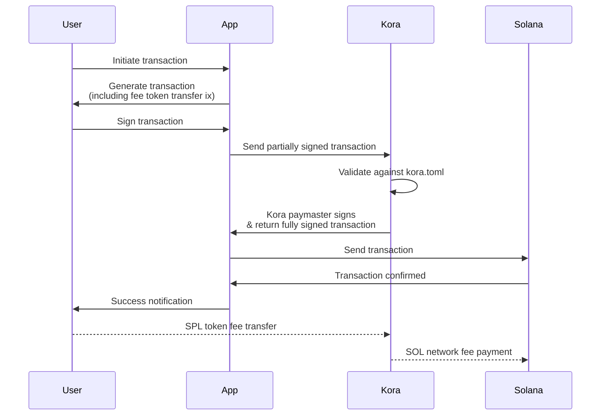

# Kora Documentation

## What is Kora?

Kora is a **fee abstraction layer** for Solana that lets users pay transaction fees with SPL tokens instead of SOL (or avoid transaction fees altogether). It's a JSON-RPC server that acts as a paymaster, sponsoring Solana network transaction fees while accepting payment in tokens your application supports.

**The Problem**: Users need SOL to pay transaction fees on Solana, creating friction for apps where users primarily hold other tokens (e.g., a Payments wallet that only uses USDC or a Game that only transacts in BONK, etc.).

**The Solution**: Kora node operators accept fee payments in SPL tokens, verify & sign transactions, and pay network fees with their own SOL—creating a gasless experience for users.

### Example Use Cases

- **Neobanks**: Let users send USDC without needing SOL for fees
- **Gaming**: Players spend in-game tokens for all transactions  
- **Liquid Staking**: Enable users of your dApp to hold/use your liquid staking tokens rather than Native SOL
- **Loyalty Rewards**: Reward users with a certain number of subsidized fees based on their loyalty level

### Key Features

- **Secure**: Configurable validation rules for programs, tokens, and accounts
- **Flexible Pricing**: Support multiple fee payment tokens with real-time pricing
- **Easy Deployment**: Ready-to-deploy [Kora CLI crate](https://crates.io/crates/kora-cli)
- **Developer Friendly**: JSON-RPC API with CLI and TypeScript SDK for seamless interaction with Solana Kit
- **Production Ready**: Built-in rate limiting, monitoring, and security features

### How It Works

Kora nodes operate as middleware between your application and Solana. All transactions on Solana require a fee payer to sign the transaction and cover network transaction fees in SOL. Additionally, transactions may need signatures from other wallets depending on the program logic (e.g., token transfers require the token owner's signature).

Kora introspects Solana transactions before they are sent to the network, ensures they meet the node's configured security requirements, and verifies the transaction includes an adequate SPL token payment instruction to the node operator. Once verified, Kora co-signs the transaction as the fee payer and returns the fully-signed transaction to the application for network submission.

### Kora Transaction Flow

1. **User initiates** a transaction
2. **App builds** a transaction (with a token payment instruction to the Kora node operator)
3. **User signs** the transaction
4. **App sends** the signed transaction to a Kora node operator
5. **Kora validates** the transaction against configured rules (allowed programs, tokens, etc.) and verifies that the payment is adequate to cover network fees (based on current market prices via an Oracle)
6. **Kora signs** the validated transaction as fee payer and returns it to the App
7. **App sends** the Kora-signed transaction to Solana for processing
8. **Solana processes** the transaction: SPL tokens flow to the node operator, SOL fees are paid by Kora, and the user's transaction is processed
9. **App confirms** the transaction landed successfully and notifies the user

The user successfully completes their transaction using only SPL tokens, while Kora handled all SOL-denominated network fees.

## Key Terminology

- **Fee payer**: The signer account of a Solana transaction that covers the network costs associated with processing the transaction on-chain.
- **Gas** (or gas fees): Costs associated with sending and landing transactions on Solana (paid in SOL).
- **Gasless Relayer**: A service that facilitates blockchain transaction on behalf of users without requiring them to directly pay gas fees (Kora is a gasless relayer).
- **JSON-RPC**: A stateless, lightweight, remote procedure call (RPC) protocol that uses JSON (JavaScript Object Notation) for data serialization. It enables communication between a client and a server by allowing the client to invoke methods on the server as if they were local functions.
- **Oracle**: A service that provides real-time price data for tokens.
- **Paymaster**: A service or account that pays transaction fees on behalf of users, typically in exchange for payment in alternative tokens or currencies (Kora node operators are paymaster).
- **Rent**: A deposit required by Solana to keep accounts active on the blockchain. Rent can be reclaimed when accounts are closed.

## Get Started

Choose your path:

### I want to try Kora quickly
**[→ Quick Start Guide](getting-started/QUICK_START.md)**

Get a local Kora server running and see fee abstraction in action in under 10 minutes.

---

### I want to run a Kora node
**[→ Node Operator Resources](operators/README.md)**

Set up and deploy your own Kora server to sponsor transactions for your application.

---

### I want to use Kora in my app

Add fee abstraction to your Solana application using the Kora SDK.

*Note: Developer integration guides are coming soon. For now, see the [Quick Start Guide](getting-started/QUICK_START.md) for basic SDK usage examples.*

---

## Need Help?

- **[Solana Stack Exchange](https://solana.stackexchange.com/)** - Ask questions with the `kora` tag
- **[GitHub Issues](https://github.com/solana-foundation/kora/issues)** - Report bugs or request features