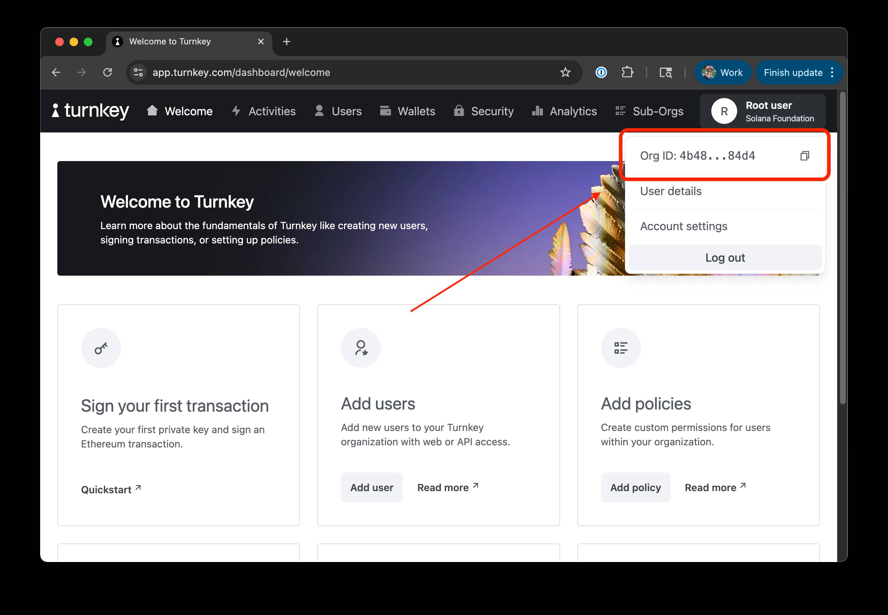
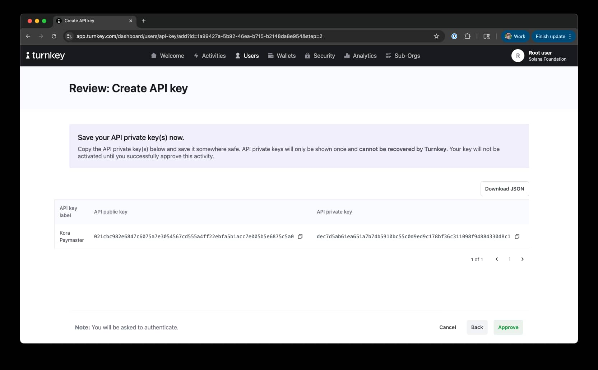
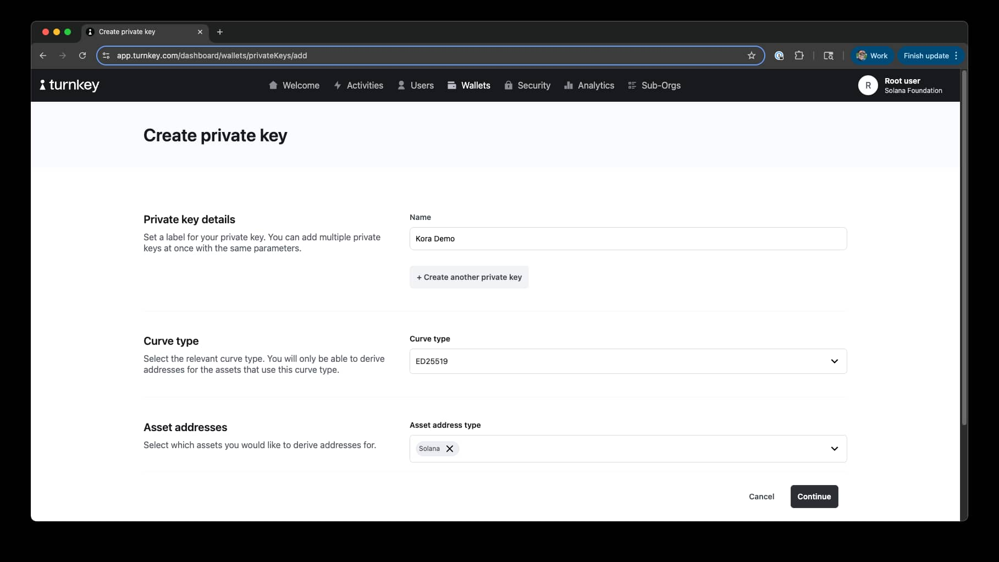
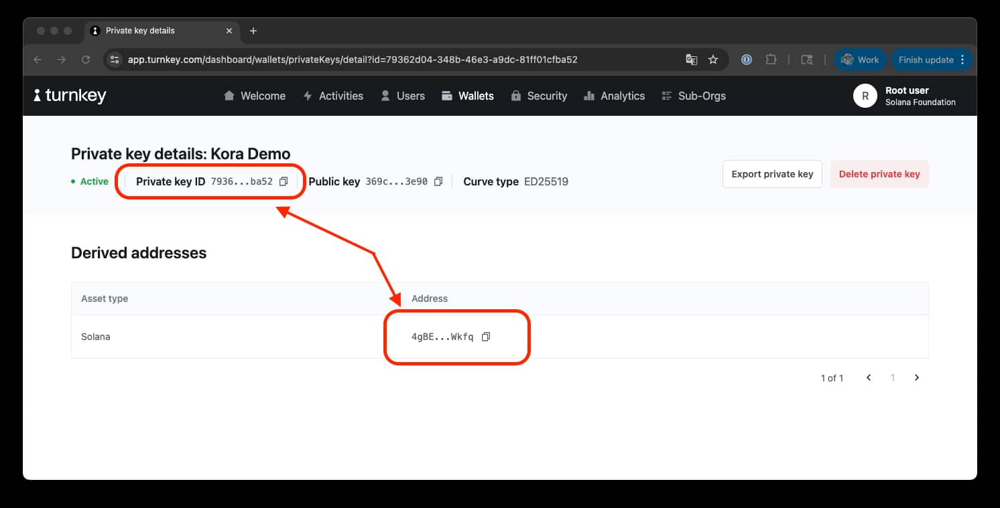
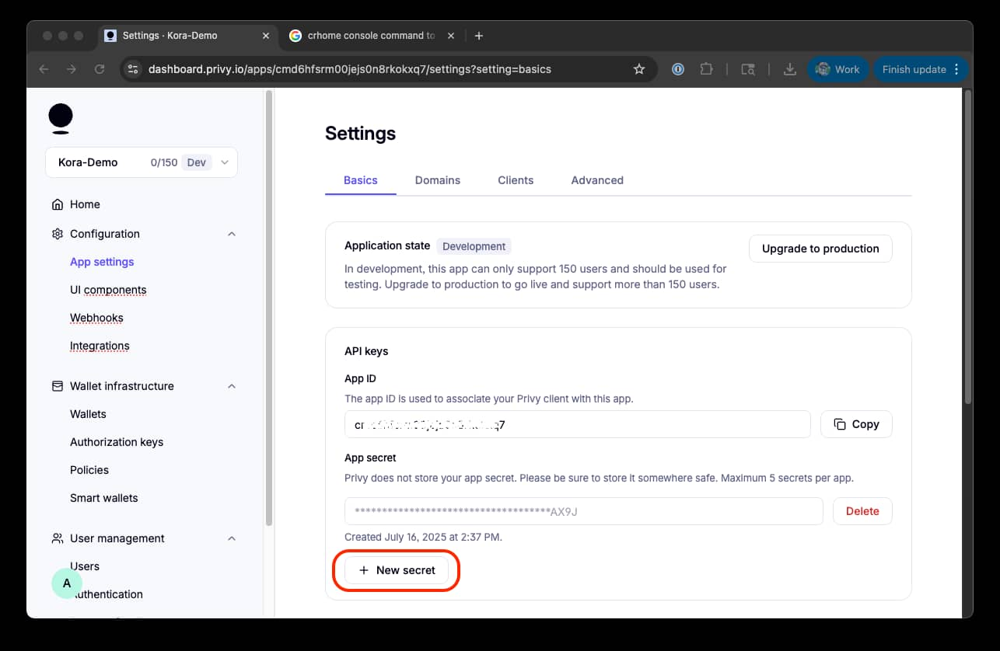
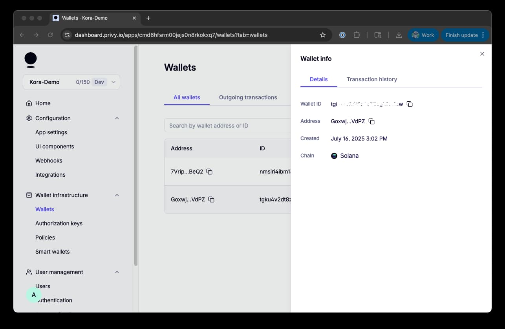

# Kora Signers Guide

## What is a Signer?

A **signer** is the cryptographic keypair that your Kora node uses to sign Solana transactions as the fee payer. When users send transactions to your Kora node, it validates them and co-signs them with your signer's private key to cover the SOL transaction fees.

Your signer keypair has direct access to your SOL funds used for paying transaction fees. If compromised, an attacker could:
- Drain your SOL balance
- Sign unauthorized transactions
- Disrupt your paymaster service

## Signer Types

Kora supports three main signer types, each with different security and operational characteristics:

- [Private Key](#private-key-signer) - simple, self-managed
- [Turnkey](#turnkey-signer) - key management service
- [Privy](#privy-signer) - key management service
- [No Signer](#no-signer) - no signer (for limited testing)

## Private Key Signer

The simplest approach - store your private key directly in environment variables or pass via CLI flags. Kora accepts private keys in three formats:

#### 1. Base58 Format (Default)
Standard Solana base58 encoded private key:

```bash
KORA_PRIVATE_KEY="5KKsLVU6TcbVDK4BS6K1DGDxnh4Q9xjYJ8XaDCG5t8ht..."
```

#### 2. U8Array Format
Array of 64 bytes in JSON format:

```bash
KORA_PRIVATE_KEY="[174, 47, 154, 16, 202, 193, 206, 113, 199, 190, 53, 133, 169, 175, 31, 56, 222, 53, 138, 189, 224, 216, 117, 173, 10, 149, 53, 45, 73, 251, 237, 246, 15, 185, 186, 82, 177, 240, 148, 69, 241, 227, 167, 80, 141, 89, 240, 121, 121, 35, 172, 247, 68, 251, 226, 218, 48, 63, 176, 109, 168, 89, 238, 135]"
```

#### 3. JSON File Path
Path to a JSON file containing the keypair:

```bash
KORA_PRIVATE_KEY="/path/to/keypair.json"
```

Where `keypair.json` contains:
```json
[174, 47, 154, 16, 202, 193, 206, 113, 199, 190, 53, 133, 169, 175, 31, 56, 222, 53, 138, 189, 224, 216, 117, 173, 10, 149, 53, 45, 73, 251, 237, 246, 15, 185, 186, 82, 177, 240, 148, 69, 241, 227, 167, 80, 141, 89, 240, 121, 121, 35, 172, 247, 68, 251, 226, 218, 48, 63, 176, 109, 168, 89, 238, 135]
```

### Generate New Keypair

You can create a new keypair for your Kora node using the Solana CLI:

```bash
# Generate new keypair file
solana-keygen new --outfile ~/.config/solana/kora-keypair.json

# Get the public key
solana-keygen pubkey ~/.config/solana/kora-keypair.json

# Fund with SOL for transaction fees
solana transfer --from <your-funding-wallet> <kora-public-key> 0.1
```

### Setup Methods

#### Method 1: Environment Variables

The Kora RPC CLI accepts the `KORA_PRIVATE_KEY` environment variable by default.

Create a `.env` file and set the `KORA_PRIVATE_KEY` environment variable:

```bash
# .env file
KORA_PRIVATE_KEY="your_private_key_here"
```

Start Kora:
```bash
kora rpc
```

#### Method 2: CLI Flags

Pass the private key directly via command line:

```bash
kora rpc --private-key "your_private_key_here"
```

## Turnkey Signer

[Turnkey](https://www.turnkey.com/) provides enterprise-grade key management with hardware security modules (HSMs) and policy controls.

### Prerequisites

You will need a **Turnkey Account** to use the Turnkey signer. Sign up at [turnkey.com](https://www.turnkey.com/)

### Setup

You will need five keys to use the Turnkey signer:

- Turnkey organization ID
- Turnkey API public key
- Turnkey API private key
- Turnkey private key ID
- Turnkey public key

Let's fetch them from Turnkey:

#### 1. Turnkey Organization

Click the user menu in the top right corner of the Turnkey dashboard and copy the organization ID: 



Store the organization ID in an environment variable:
```bash
TURNKEY_ORGANIZATION_ID="your_organization_id"
```

#### 2. Turnkey API Keys

- Click the user menu in the top right corner of the Turnkey dashboard and click "Account Settings".
- Under "API Keys", click "+ Create API Key".
- Select "Generate API keys in-browser"
- Enter a name for the API key and click "Continue"
- Save the public and private keys and click "Approve"



Store the API public and private keys in environment variables:
```bash
TURNKEY_API_PUBLIC_KEY="your_turnkey_api_public_key"
TURNKEY_API_PRIVATE_KEY="your_turnkey_api_private_key"
```

#### 3. Turnkey Wallet Keys

From the main menu, navigate to ["Wallets"](https://app.turnkey.com/dashboard/wallets) and click "Create Private Key".

We are going to create a new ED25519 private key with "Solana" asset address type:



Click "Continue" and then "Approve".

From your wallets page, you should see your new private key. Click on it to view the details. You will need to copy the "Private key ID" and wallet "Address". Save them to environment variables:

```bash
TURNKEY_PRIVATE_KEY_ID="your_private_key_id" #7936...
TURNKEY_PUBLIC_KEY="your_solana_address" # 4gBe...
```



You will need to fund the wallet with SOL to pay for transaction fees.

### Configure Environment Variables

You should now have the following environment variables:

```bash
# .env file
TURNKEY_ORGANIZATION_ID="your_organization_id"
TURNKEY_API_PUBLIC_KEY="your_turnkey_api_public_key"
TURNKEY_API_PRIVATE_KEY="your_turnkey_api_private_key"
TURNKEY_PRIVATE_KEY_ID="your_private_key_id"
TURNKEY_PUBLIC_KEY="your_solana_public_key"
```

See [.env.example](../../.env.example) for a complete example.

### Start Kora with Turnkey

To start Kora with the Turnkey signer, you just use the `--with-turnkey-signer` flag:

```bash
kora rpc --with-turnkey-signer
```

### CLI Alternative

When deploying on a server, you may want to pass Turnkey secrets via CLI flags:

```bash
kora rpc \
    --with-turnkey-signer \
    --turnkey-api-public-key "your_api_public_key" \
    --turnkey-api-private-key "your_api_private_key" \
    --turnkey-organization-id "your_org_id" \
    --turnkey-private-key-id "your_key_id" \
    --turnkey-public-key "your_public_key"
```

For support with Turnkey, see the [Turnkey documentation](https://docs.turnkey.com/embedded-wallets/overview).


## Privy Signer

[Privy](https://www.privy.io/) offers embedded wallet infrastructure with secure key management for Web3 applications.

### Prerequisites

You will need a **Privy Account** to use the Privy signer. Sign up at [privy.io](https://www.privy.io/)

### Setup 

You will need three keys to use the Privy signer:

- Privy App ID
- Privy App Secret
- Privy Wallet ID

Let's fetch them from Privy:

#### 1. Privy App ID

From your dashboard, select the application you want to use for Kora (or click "+ New app" if you don't have one).

Select "Retrieve API Keys" anc click "+ New Secret":



Copy your "App ID" and "App Secret" and store them in environment variables:

```bash
PRIVY_APP_ID="your_privy_app_id"
PRIVY_APP_SECRET="your_privy_app_secret"
```

#### 2. Privy Wallet

Next, we'll need to create a new wallet for Kora. From your dashboard's sidebar click "Wallets" under "Wallet Infrastructure", and select "New Wallet".

Select "Solana" as the blockchain and click "Save".

Click on the wallet to view the details:



Copy the "Wallet ID" and store them in environment variables:

```bash
PRIVY_WALLET_ID="your_privy_wallet_id"
```

You will need to fund the wallet with SOL to pay for transaction fees.

### Configure Environment Variables

You should now have the following environment variables:

```bash
# .env file
PRIVY_APP_ID="your_privy_app_id"
PRIVY_APP_SECRET="your_privy_app_secret"
PRIVY_WALLET_ID="your_wallet_id"
```

See [.env.example](../../.env.example) for a complete example.

### Start Kora with Privy

To start Kora with the Privy signer, you just use the `--with-privy-signer` flag:

```bash
kora rpc --with-privy-signer
```

### CLI Alternative

Pass Privy credentials via CLI flags:

```bash
kora rpc \
    --with-privy-signer \
    --privy-app-id "your_app_id" \
    --privy-app-secret "your_app_secret" \
    --privy-wallet-id "your_wallet_id"
```

For support with Privy, see the [Privy documentation](https://docs.privy.io/wallets/overview).

## No Signer

If no signer is configured, Kora will throw an error. If you want to run Kora without a signer, you run it with the `--no-signer` flag:

```bash
kora rpc --no-signer
```

Note that this will limit your node to only processing requests that do not require a signer.

## Troubleshooting

### Quick Reference

| Error Message | Signer Type | Quick Fix |
| ---- | ---- | ---- |
| "Private key required for memory signer" | Private Key | Set `KORA_PRIVATE_KEY` env var |
| "Invalid base58 string" | Private Key | Check key format, no extra spaces |
| "Invalid private key length" | Private Key | Use complete 64-byte Solana key |
| "Turnkey {key} required" | Turnkey | Set `TURNKEY_{key}` |
| "Privy {key} required" | Privy | Set `PRIVY_{key}` |
| "Failed to sign with \[service\]" | Any | Check service status & credentials |

### General Debugging Tips

#### Enable Verbose Logging
Add detailed logging to diagnose issues:
```bash
RUST_LOG=debug kora rpc --with-turnkey-signer
```

#### Minimal Working Configuration
Start with the simplest setup and add complexity:
```bash
# Generate and test with a new local keypair first
solana-keygen new --outfile test-keypair.json
# Test with the new keypair
kora rpc --private-key "test-keypair.json"
```

## Security & Best Practices

- Use dedicated keypairs for Kora (don't reuse personal wallets)
- Only fund with SOL you're willing to spend on fees
- Maintain minimal operational balance with automated monitoring and top-offs
- Implement monitoring and alerting for unusual activity
- Consider key management services (see [Privy](#privy-signer) and [Turnkey](#turnkey-signer))
- All private keys and API keys should be stored in environment variables or secrets management systems (Railway secrets, AWS Secrets Manager, etc.)
