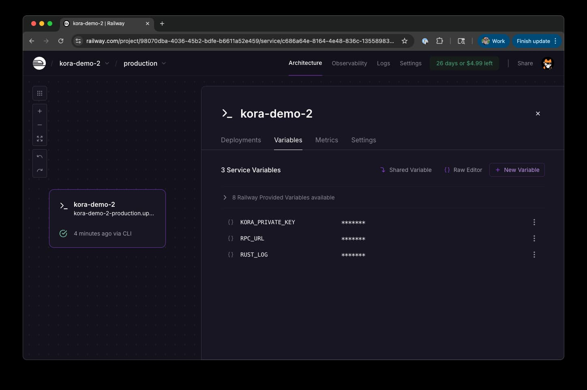
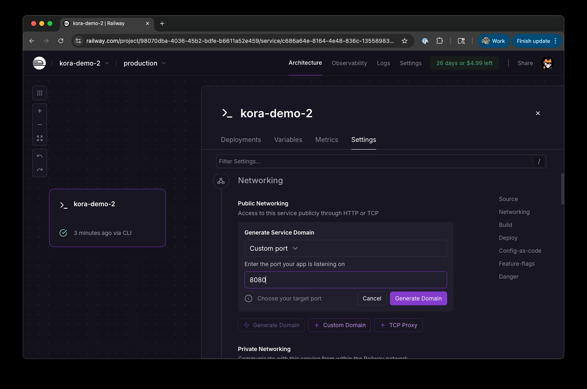

# Deploy Kora to Railway

[Railway](https://railway.com/) offers an easy deployment experience for Kora nodes with automatic SSL, domain management, and built-in monitoring. This guide will walk through setting up a Kora node on railway with a simple Docker image and the Railway CLI. 

## Prerequisites

- [Railway Account](https://railway.app)
- [Railway CLI](https://docs.railway.com/guides/cli) installed
- [Solana CLI](https://solana.com/docs/intro/installation) for private key creation
- [Solana RPC Endpoint](https://solana.com/rpc)

## Step 1: Prepare Deployment Files

Create a new directory for your Kora node:

```bash
mkdir my-kora-node
cd my-kora-node
```

Add the sample files to your directory:

- [kora.toml](../deploy/sample/kora.toml)
- [Dockerfile](../deploy/sample/Dockerfile)

Your directory should now look like:

```bash
my-kora-node/
├── kora.toml
└── Dockerfile
```

## Step 2: Deploy to Railway

From your project directory, login to Railway

```bash
# Login to Railway
railway login
```

Follow the on-screen instructions to log in with your account.

Initialize Railway project in your directory.

```bash
railway init
```

Railway will prompt you to:
1. Create a new project or select existing
2. Choose a project name (e.g., "my-kora-node")

### Deploy Your Application

```bash
# Deploy the application
railway up
```

This will:
- Upload your files to Railway
- Build the Docker image
- Deploy your application

**Expected output:**
```
Build time: 121.81 seconds
Deploy complete
Starting Container
```

Great! We are all set up! You will probably notice an error in your logs ("error: a value is required for '--rpc-url <RPC_URL>' but none was supplied
"). This is because we have not yet configured our environment variables--so let's do that next.

## Step 3: Configure Environment Variables

Open your Railway dashboard at [railway.app](https://railway.app) and navigate to your project. In your project, click "Settings" > "Variables"



Add these environment variables:

| Variable | Value | Description |
|----------|-------|-------------|
| `RPC_URL` | `https://api.mainnet-beta.solana.com` | Solana RPC endpoint |
| `PRIVATE_KEY` | `your-base58-private-key` | Your Solana private key (base58 format) |
| `RUST_LOG` | `info` | Log level for debugging |

> **Security Warning**: Your private key has access to SOL for paying fees. Use a dedicated keypair for your Kora node and only fund it with the SOL you're willing to spend on transaction fees. <!-- TODO link to signers guide -->


### Getting Your Private Key

If you need to create a new keypair:

```bash
# Generate new keypair
solana-keygen new --outfile ~/.config/solana/kora-keypair.json
```

Make sure to deposit adequate SOL for testing/operator your node.

## Step 4: Redeploy

After saving your variables, you will be prompted to redeploy your server--do that.

## Step 5: Test Your Deployment


### Generate Public Endpoint

To send requests to your endpoint, you will need to generate a public Domain. 
From your deployment, go to "Settings" > "Generate domain".



Use the default port, "8080" and click "Generate Domain".

You should get a domain like `https://my-kora-node.railway.app/`

### Test Configuration Endpoint

```bash
curl -X POST https://my-kora-node.railway.app \
  -H "Content-Type: application/json" \
  -d '{"jsonrpc":"2.0","id":1,"method":"getConfig","params":[]}' | jq
```

**Expected response:**
```json
{
  "jsonrpc": "2.0",
  "id": 1,
  "result": {
    "fee_payer": "YourPublicKeyHere...",
    "validation_config": {
      "max_allowed_lamports": 1000000,
      "allowed_programs": [...],
      "allowed_spl_paid_tokens": [...]
      // ...
    }
  }
}
```

Nice job! Your Kora node is now live.

**Need Help?**
- **[Kora Node Operators Guide](../README.md)** - Common issues and solutions
- **[Railway Documentation](https://docs.railway.app/)** - Platform-specific help
- **[GitHub Issues](https://github.com/solana-foundation/kora/issues)** - Report bugs or get support
- **[Solana Stack Exchange](https://solana.stackexchange.com/)** - Ask questions/share learnings (make sure to use the `kora` tag)
